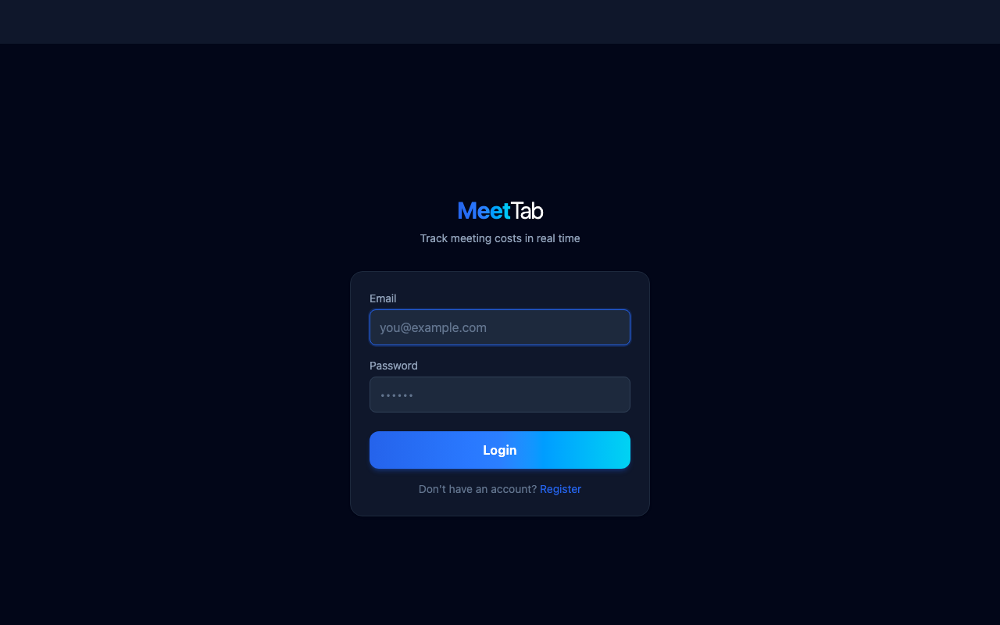
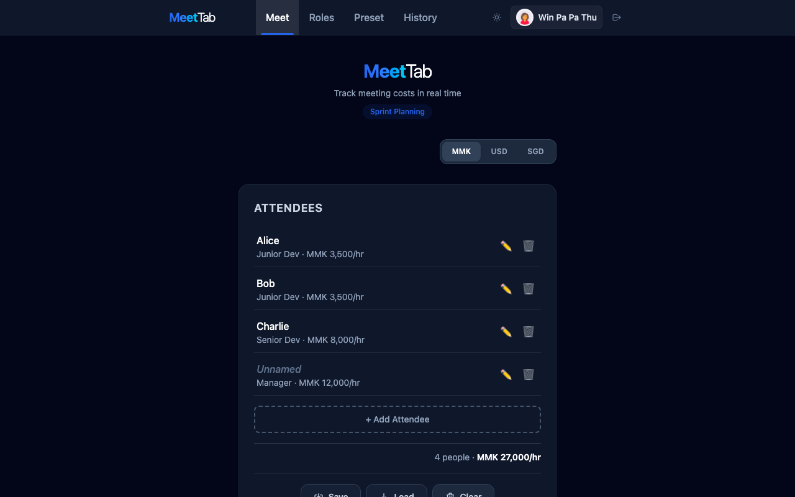
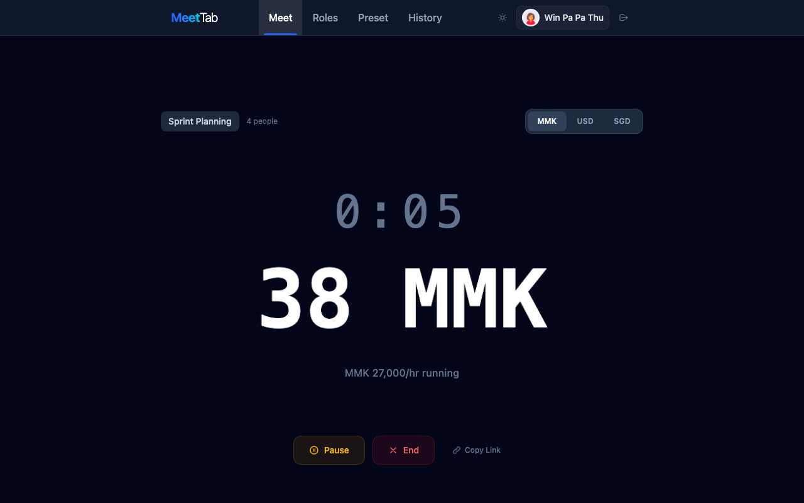
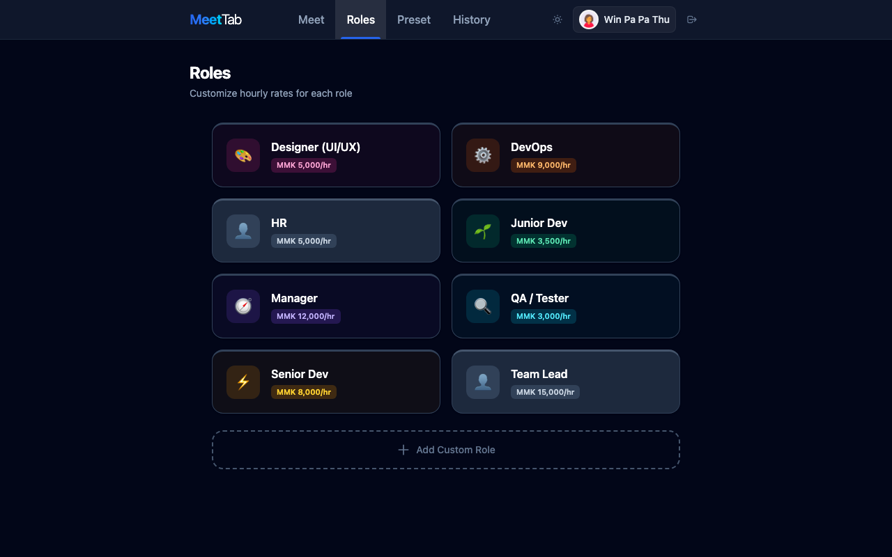
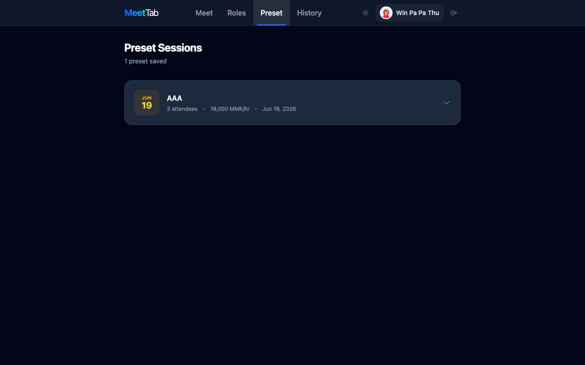
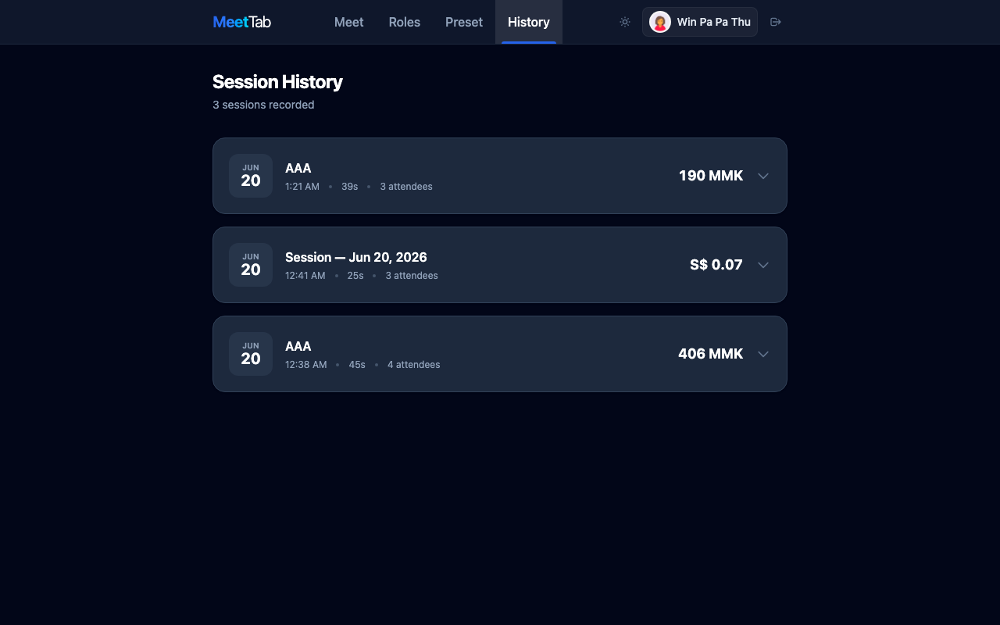
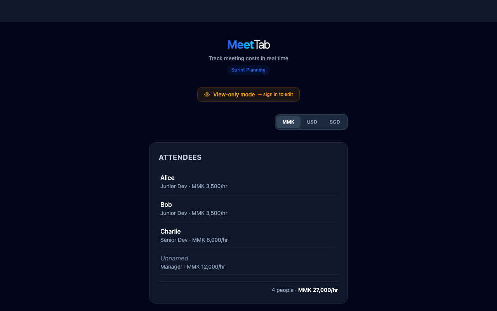

<div align="center">

# 📊 MeetTab

### Meeting Cost Live Counter

<p>A privacy-first meeting cost timer that shows the real-time cost of your meetings on a projector — using role-based market rate presets instead of anyone's actual salary.</p>

[](https://nextjs.org/)
[](https://react.dev/)
[](https://www.typescriptlang.org/)
[](https://tailwindcss.com/)
[](https://www.mongodb.com/)
[](https://opensource.org/licenses/MIT)

<br />

[](https://meet-tab.vercel.app/)
[](https://github.com/winpapathu1994/meet-tab/pulls)

</div>

---

## 🚀 Live Demo

**🌐 [meet-tab.vercel.app](https://meet-tab.vercel.app/)**

Try it out! Register an account or use a share link to view in read-only mode.

---

## 📸 Screenshots

<div align="center">

<table>
<tr>
<td width="50%" align="center">
<h3>🔐 Login Page</h3>

</td>
<td width="50%" align="center">
<h3>👥 Meeting Setup</h3>

</td>
</tr>
<tr>
<td width="50%" align="center">
<h3>⏱️ Live Meeting Timer</h3>

</td>
<td width="50%" align="center">
<h3>📊 Role Management</h3>

</td>
</tr>
<tr>
<td width="50%" align="center">
<h3>💾 Preset Sessions</h3>

</td>
<td width="50%" align="center">
<h3>📜 Session History</h3>

</td>
</tr>
<tr>
<td width="50%" align="center">
<h3>🔗 Shared Link</h3>

</td>
<td width="50%"></td>
</tr>
</table>

</div>

---

## ✨ Features

| Feature | Description |
|---------|-------------|
| ⏱️ **Real-time Cost Ticker** | Updates every second with large projector-friendly font and digit-flash animation |
| 👥 **Role-based Rate System** | 6 built-in Myanmar market rate presets with full CRUD for custom roles |
| 🏷️ **Named Attendees** | Each attendee gets a name, role, and snapshotted hourly rate |
| 💾 **Preset Sessions** | Save and restore common attendee configurations for recurring meetings |
| 📜 **Session History** | Completed meetings saved with full attendee breakdown, cost, and duration |
| 🔗 **URL Share Links** | Encode role config and names in query parameters — viewable without login |
| 💱 **Multi-currency Display** | MMK (default), USD, and SGD with static CBM official exchange rates |
| 🌙 **Dark/Light Mode** | Dark mode by default, persisted to localStorage |
| 👤 **User Profiles** | Avatar upload, name and password editing |
| 📖 **API Documentation** | Interactive Swagger UI at `/api-docs` |
| 🔒 **Privacy-first Design** | Uses role-based market rate presets instead of real salaries |

---

## 🛠️ Tech Stack

| Layer | Technology | Version |
|-------|-----------|---------|
| **Framework** | Next.js (App Router) | 16.x |
| **Language** | TypeScript | 5.8 |
| **UI Library** | React | 19.x |
| **Styling** | Tailwind CSS | 4.x |
| **Database** | MongoDB via Mongoose | 9.x |
| **Authentication** | JWT in httpOnly cookies | 9.x |
| **Password Hashing** | bcryptjs | 3.x |
| **API Docs** | Swagger UI + OpenAPI | 3.0 |
| **Hosting** | Vercel | Free Tier |

> No component library — all UI is custom-built with Tailwind utility classes. State management via React Context and custom hooks.

---

## 📋 Prerequisites

- **Node.js** 18+
- **MongoDB** running locally on `mongodb://localhost:27017`
- **npm** or **yarn** package manager

---

## 🚀 Quick Start

### 1. Clone the repository

```bash
git clone https://github.com/winpapathu1994/meet-tab.git
cd meet-tab
```

### 2. Install dependencies

```bash
npm install
```

### 3. Set up environment variables

```bash
cp .env.local.example .env.local
```

Edit `.env.local` with your configuration:

```env
MONGODB_URI=mongodb://localhost:27017/meet-tab
JWT_SECRET=your-random-64-character-hex-string
```

> 💡 Generate a JWT secret: `openssl rand -hex 32`

### 4. Start MongoDB

```bash
# In a separate terminal
mongod
```

### 5. Seed default roles

```bash
export $(grep -v '^#' .env.local | xargs) && npx tsx scripts/seed-roles.ts
```

### 6. Start the development server

```bash
npm run dev
```

Open [http://localhost:3000](http://localhost:3000) — login or register, then you'll be taken to `/meet`.

---

## 📜 Available Scripts

| Command | Description |
|---------|-------------|
| `npm run dev` | Start Next.js dev server with Turbopack |
| `npm run build` | TypeScript type-check then production build |
| `npm start` | Start the production server |
| `npx tsx scripts/seed-roles.ts` | Seed default roles into MongoDB |

---

## 📁 Project Structure

```
meet-tab/
├── .env.local                    # Environment variables (gitignored)
├── scripts/
│   └── seed-roles.ts             # MongoDB role seeder
├── public/
│   ├── uploads/                  # User avatar files
│   └── screenshots/              # Application screenshots
└── src/
    ├── app/                      # Next.js App Router
    │   ├── layout.tsx            # Root layout (Providers + NavBar)
    │   ├── page.tsx              # Login page (/)
    │   ├── register/             # Registration page
    │   ├── meet/                 # Main timer page
    │   ├── roles/                # Role CRUD page
    │   ├── presets/              # Preset sessions page
    │   ├── history/              # Session history page
    │   ├── api-docs/             # Swagger UI
    │   └── api/                  # API routes
    │       ├── auth/             # Authentication endpoints
    │       ├── attendees/        # Session persistence
    │       ├── roles/            # Role CRUD
    │       ├── presets/          # Preset CRUD
    │       └── sessions/         # Session history
    ├── components/               # React components
    ├── contexts/                 # React contexts (Auth, Theme)
    ├── hooks/                    # Custom hooks
    ├── lib/                      # Utilities and models
    │   ├── auth.ts               # JWT helpers
    │   ├── db.ts                 # MongoDB connection
    │   └── models/               # Mongoose models
    ├── data/                     # Static data (roles, rates)
    └── types/                    # TypeScript types
```

---

## 🔌 API Reference

### Authentication

| Method | Route | Body | Response |
|--------|-------|------|----------|
| `POST` | `/api/auth/register` | `{ name, email, password }` | `{ user }` + cookie |
| `POST` | `/api/auth/login` | `{ email, password }` | `{ user }` + cookie |
| `GET` | `/api/auth/me` | — | `{ user \| null }` |
| `POST` | `/api/auth/logout` | — | `{ ok: true }` |
| `PUT` | `/api/auth/profile` | `{ name?, currentPassword?, newPassword? }` | `{ user }` |
| `POST` | `/api/auth/avatar` | FormData `file` | `{ image }` |

### Roles (Public Read, Auth Required for Mutations)

| Method | Route | Body | Response |
|--------|-------|------|----------|
| `GET` | `/api/roles` | — | `{ roles }` |
| `POST` | `/api/roles` | `{ label, hourlyRate }` | `{ role }` |
| `PUT` | `/api/roles/[id]` | `{ label?, hourlyRate? }` | `{ role }` |
| `DELETE` | `/api/roles/[id]` | — | `{ ok: true }` |

### Attendee Session (Auth Required)

| Method | Route | Body | Response |
|--------|-------|------|----------|
| `GET` | `/api/attendees` | — | `{ attendees }` |
| `PUT` | `/api/attendees` | `{ attendees }` | `{ attendees }` |
| `DELETE` | `/api/attendees` | — | `{ ok: true }` |

### Preset Sessions (Auth Required)

| Method | Route | Body | Response |
|--------|-------|------|----------|
| `GET` | `/api/presets` | — | `{ presets }` |
| `POST` | `/api/presets` | `{ name, attendees }` | `{ preset }` |
| `PUT` | `/api/presets/[id]` | `{ name?, attendees? }` | `{ preset }` |
| `DELETE` | `/api/presets/[id]` | — | `{ ok: true }` |

### Session History (Auth Required)

| Method | Route | Body | Response |
|--------|-------|------|----------|
| `GET` | `/api/sessions` | — | `{ sessions }` |
| `POST` | `/api/sessions` | `{ sessionName, attendees, totalCostMMK, elapsedSeconds, currency }` | `{ session }` |
| `DELETE` | `/api/sessions/[id]` | — | `{ ok: true }` |

### Documentation

| Method | Route | Description |
|--------|-------|-------------|
| `GET` | `/api/docs` | OpenAPI 3.0 JSON spec |
| `GET` | `/api-docs` | Swagger UI interactive docs |

> 💡 **Interactive API Documentation**: Visit [http://localhost:3000/api-docs](http://localhost:3000/api-docs) for Swagger UI

---

## 🎯 Page Routes

| Path | Description | Auth Required |
|------|-------------|:-------------:|
| `/` | Login form (redirects to `/meet` if logged in) | ❌ |
| `/register` | Registration form (redirects if logged in) | ❌ |
| `/meet` | Attendee CRUD, timer, save sessions, share | View-only |
| `/roles` | Role CRUD — grid cards with color-coded icons | ✅ |
| `/presets` | Preset Sessions — reuse or delete saved configs | ✅ |
| `/history` | Session History — past meeting records | ✅ |
| `/api-docs` | Swagger UI interactive API documentation | ❌ |

> **Note:** `/meet` allows unauthenticated access only when `?r=` share params are present — guests see a read-only view with a "View-only mode" badge.

---

## 💰 Role Presets

Yangon tech sector market rates (MMK per hour — June 2026):

| Role | Rate | Icon |
|------|------|------|
| Junior Dev | MMK 3,500/hr | 💻 |
| Senior Dev | MMK 8,000/hr | 🖥️ |
| Manager | MMK 12,000/hr | 👔 |
| Designer (UI/UX) | MMK 5,000/hr | 🎨 |
| QA / Tester | MMK 3,000/hr | 🔍 |
| DevOps | MMK 9,000/hr | ⚙️ |

Roles are seeded via `npx tsx scripts/seed-roles.ts` and manageable at `/roles`.

---

## 💱 Currency Support

| Currency | Rate (CBM, June 2026) | Symbol |
|----------|----------------------|--------|
| MMK | 1 : 1 | K |
| USD | 1 USD = 3,658 MMK | $ |
| SGD | 1 SGD = 1,653 MMK | S$ |

Toggle currencies live — the counter and attendee rates convert instantly.

---

## 🔗 URL Sharing

Role selections and attendee names are encoded as query parameters:

```
https://meet-tab.vercel.app/meet?r=junior:2,senior:1&n=Alice,Bob&name=Sprint+Planning
```

Open that URL on any device — **no login required**. The role config loads automatically in view-only mode. Authenticated users get full edit access. Press **Copy Link** during a meeting to grab the shareable URL.

---

## 📜 Session History

When you click **End Meeting**, the session is saved to MongoDB and you're taken to the History page. Each record shows:

- Session name and date
- Total elapsed time
- Number of attendees
- Total cost
- Expandable attendee breakdown with per-person cost contribution
- Delete button to remove old records

---

## ⚙️ Environment Variables

| Variable | Description | Example |
|----------|-------------|---------|
| `MONGODB_URI` | MongoDB connection string | `mongodb://localhost:27017/meet-tab` |
| `JWT_SECRET` | Secret key for JWT signing (64 chars) | `openssl rand -hex 32` |

---

## 🚀 Deployment

### Vercel (Recommended)

1. Push your code to GitHub
2. Import the repository in [Vercel](https://vercel.com)
3. Add environment variables:
   - `MONGODB_URI` — Your MongoDB Atlas connection string
   - `JWT_SECRET` — Generate with `openssl rand -hex 32`
4. Deploy!

### Manual Deployment

```bash
# Build for production
npm run build

# Start production server
npm start
```

---

## 🤝 Contributing

Contributions are welcome! Please feel free to submit a Pull Request.

1. Fork the repository
2. Create your feature branch (`git checkout -b feature/amazing-feature`)
3. Commit your changes (`git commit -m 'Add some amazing feature'`)
4. Push to the branch (`git push origin feature/amazing-feature`)
5. Open a Pull Request

---

## 📄 License

This project is licensed under the MIT License - see the [LICENSE](LICENSE) file for details.

---

## 🙏 Acknowledgments

- Built with [Next.js](https://nextjs.org/) and [Tailwind CSS](https://tailwindcss.com/)
- Myanmar market rates sourced from Yangon tech sector surveys
- Currency rates from Central Bank of Myanmar (CBM)

---

<div align="center">

**Made with ❤️ for Myanmar Tech Community**

[](https://github.com/winpapathu1994/meet-tab/stargazers)
[](https://github.com/winpapathu1994/meet-tab/network/members)

</div>
